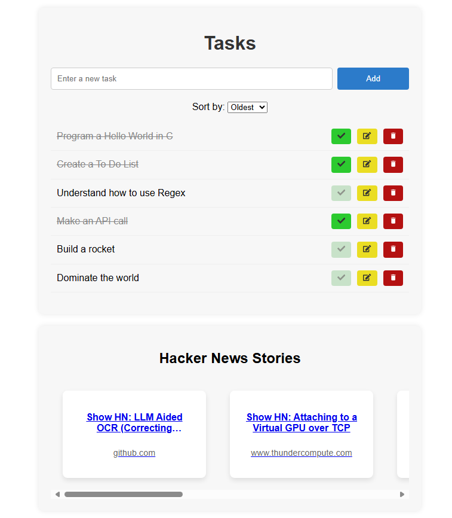

# Tasks and News Frontend

## Description

This is the frontend for the **Tasks and News** application. The app is a to-do list with CRUD operations that also features a carousel displaying top stories from Hacker News.

## Info

The backend for this project can be found in this repository: [TasksAndNews Service](https://github.com/helenafnandes/tasksandnews-service)

This app was built with React and Vite and containerized with Docker.

<div align="center">
  
</div>


## Installation

To run the frontend using Docker:

1. Clone the repository:
   ```
   git clone https://github.com/helenafnandes/tasksandnews-frontend.git
   cd tasksandnews-frontend
   ```

2. Build the Docker image:
    ```
    docker build -t tasksandnews-frontend .
    ```

3. Run the container:
    ```
    docker run -p 3000:3000 tasksandnews-frontend
    ```

  The app will be available at http://localhost:3000.
